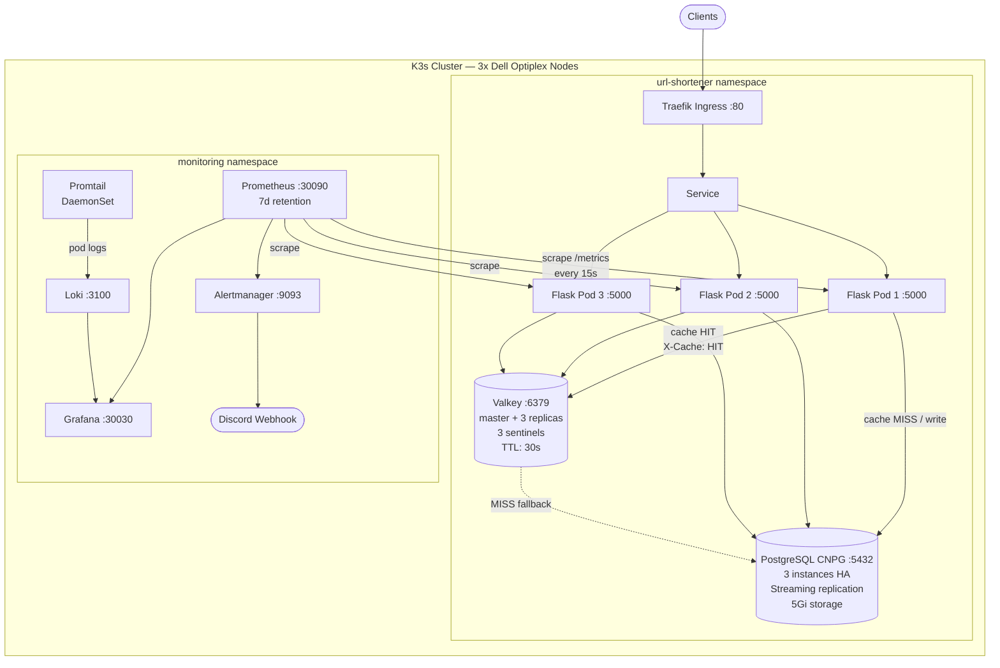
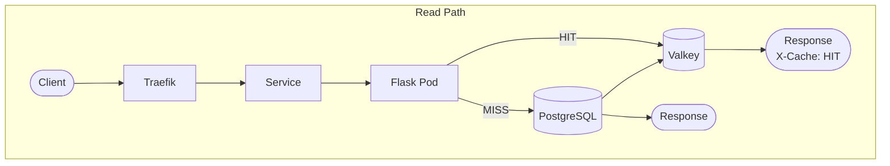
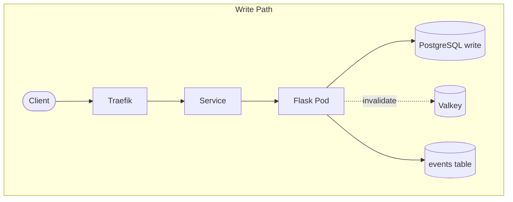
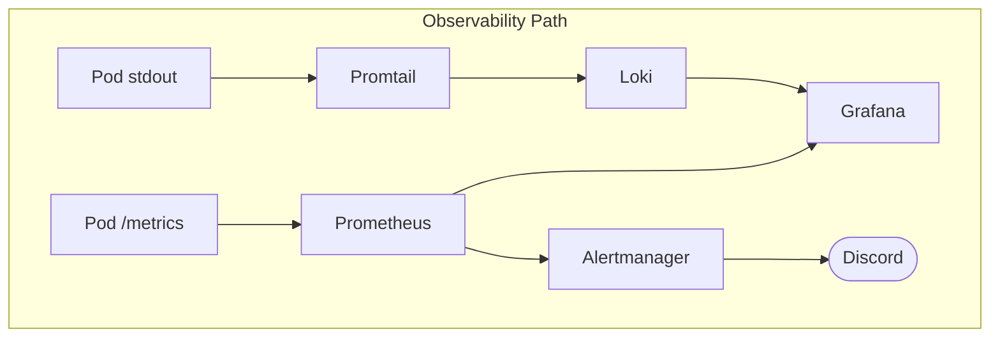
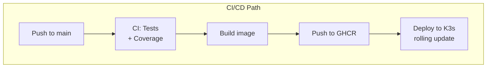
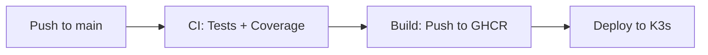

# System Architecture

## Overview

A URL shortener API deployed on a self-hosted K3s Kubernetes cluster running across **3 physical Dell Optiplex nodes**. The application runs as a Flask deployment with 3 replicas, backed by a CloudNativePG PostgreSQL cluster (3 instances) for persistent storage and a Valkey (Redis-compatible) replication cluster for caching. A full observability stack (Prometheus, Grafana, Loki, Alertmanager) runs in a dedicated monitoring namespace. CI/CD is handled by GitHub Actions: tests run on push, images are built and pushed to GHCR, and deployments roll out automatically to K3s.

## Diagram

## Data Flow

## Component Reference

| Component    | Description                 | K8s Port / NodePort |
| ------------ | --------------------------- | ------------------- |
| Traefik      | Ingress controller (K3s)    | 80                  |
| Flask app    | API server (3 replicas)     | 5000 / 30080        |
| Valkey       | In-memory cache (HA)        | 6379                |
| PostgreSQL   | Persistent storage (CNPG)   | 5432                |
| Prometheus   | Metrics collection          | 9090 / 30090        |
| Grafana      | Dashboards & visualization  | 3000 / 30030        |
| Alertmanager | Alert routing               | 9093                |
| Loki         | Log aggregation             | 3100                |
| Promtail     | Log shipper (DaemonSet)     | —                   |

## Components

### 1. Traefik Ingress (`:80`)

K3s ships with Traefik as its built-in ingress controller. An Ingress resource routes incoming traffic to the `url-shortener-svc` Service, which load-balances across the Flask pods. The app is also accessible directly via NodePort 30080.

### 2. Flask + Peewee: App Deployment (`:5000`, 3 replicas)

Stateless API pods running the Flask application. The Deployment pulls the image from `ghcr.io/pipeliedev/pe-hackathon:latest` (GitHub Container Registry). Each pod exposes:

| Method | Route       | Description                |
| ------ | ----------- | -------------------------- |
| `GET`  | `/health`   | Liveness probe             |
| `GET`  | `/ready`    | Readiness probe            |
| `GET`  | `/metrics`  | Prometheus scrape endpoint |
| `CRUD` | `/users/*`  | User resource              |
| `CRUD` | `/urls/*`   | URL resource               |
| `CRUD` | `/events/*` | Event log resource         |

**Why 3 replicas?** Running three replicas provides high availability and rolling update support. If a pod crashes or is being redeployed, Kubernetes routes traffic to healthy pods with zero downtime. The Deployment is configured with liveness and readiness probes to automatically restart unhealthy pods and remove them from the Service until they're ready.

**Resources:** 2 CPU / 2Gi memory (requests), 4 CPU / 4Gi memory (limits).

### 3. Valkey: Cache Layer (`:6379`)

Deployed via the Bitnami Helm chart with a replication architecture: one master, 3 replicas, and 3 Sentinel instances for automatic failover. No authentication (internal cluster traffic only). Persistence is disabled — Valkey is used purely as a cache.

All cached entries expire after **30 seconds** (TTL). Responses served from cache include an `X-Cache: HIT` header. Write operations (POST / PUT / DELETE) invalidate the relevant cache keys immediately to prevent stale reads.

**Resources:** 250m CPU / 256Mi memory (requests), 500m CPU / 512Mi memory (limits) per node.

> Note:
> Valkey is a community-maintained hard fork of Redis 7.2 (the last BSD-licensed version), governed by the Linux Foundation. It is API-compatible with Redis. No code changes are needed to switch and it remains fully open source under the BSD license, avoiding the SSPL licensing concerns introduced by Redis in 2024.

### 4. PostgreSQL: Persistent Storage (CNPG, `:5432`)

Deployed via [CloudNativePG](https://cloudnative-pg.io/) (CNPG) — a Kubernetes operator for managing PostgreSQL clusters natively. The cluster runs **3 instances** with streaming replication for high availability. CNPG handles automatic failover, backup, and recovery.

Three tables:

- **users**: account records
- **urls**: URL entries
- **events**: append-only event log written on every mutation

**Storage:** 5Gi persistent volume per instance. **Shared buffers:** 256MB. **Max connections:** 200.

**Resources:** 500m CPU / 1Gi memory (requests), 2 CPU / 2Gi memory (limits).

## Monitoring Stack

All monitoring components run in a dedicated `monitoring` namespace, isolated from the application workloads.

### 1. Prometheus (`:9090`, NodePort `:30090`)

Scrapes `/metrics` from Flask pods every 15 seconds using **Kubernetes service discovery** — it automatically discovers pods in the `url-shortener` namespace. Stores time-series data with a 7-day retention period and evaluates 8 alerting rules.

Prometheus uses a pull model: it controls the scrape schedule and can detect when a target goes silent (a dead pod that stops responding is itself an alert condition).

**Alert rules:**

| Alert                  | Severity | Condition                          |
| ---------------------- | -------- | ---------------------------------- |
| ServiceDown            | critical | Target down for > 1m               |
| HighErrorRate          | warning  | > 5% error rate over 5m            |
| HighLatency            | warning  | p95 latency > 2s                   |
| HighCPUUsage           | warning  | CPU utilization > 90%              |
| HighErrorRateCritical  | critical | > 25% 5xx error rate               |
| HighAppCPU             | warning  | Process CPU > 80% for 3m           |
| HighMemory             | warning  | Memory > 512MB                     |
| NoRequests             | warning  | Zero traffic for 5m                |

### 2. Grafana (`:3000`, NodePort `:30030`)

Visualization layer. Auto-provisioned with Prometheus and Loki as datasources so dashboards can correlate a spike in error rate with the exact log lines that caused it. Dashboards are loaded from provisioned config on startup.

### 3. Loki (`:3100`) & Promtail (DaemonSet)

Promtail runs as a **DaemonSet** on every node, tailing pod logs from `/var/log/pods` and shipping structured log lines to Loki. It filters for logs from the `url-shortener` namespace and parses CRI log format + JSON fields.

Loki indexes labels (not full text) for efficient querying — storage footprint is a fraction of what Elasticsearch would require for equivalent log volume.

### 4. Alertmanager (`:9093`)

Receives firing alerts from Prometheus, deduplicates and groups them, then routes notifications to a **Discord webhook**. Critical alerts route to a dedicated `discord-critical` receiver. Group wait is 10 seconds; repeat interval is 1 hour.

Discord is the team's coordination channel, so routing alerts there means no additional tooling cost and no context switch.

## CI/CD Pipeline

| Workflow                  | Trigger                          | Runner         | What it does                                                    |
| ------------------------- | -------------------------------- | -------------- | --------------------------------------------------------------- |
| **CI** (`ci.yml`)         | Push to `main`/`dev/*`, PRs      | GitHub-hosted  | Tests with Postgres + Valkey services, 70% coverage gate        |
| **Build** (`build.yml`)   | Push to `main`, manual           | GitHub-hosted  | Builds Docker image, pushes to GHCR (`:latest` + `:${SHA}`)    |
| **Deploy** (`deploy.yml`) | After successful build, manual   | Self-hosted K3s| Updates deployment image, triggers rolling update, verifies pods|
| **Deploy Monitoring**     | Manual dispatch                  | Self-hosted K3s| Creates ConfigMaps from `monitoring/` sources, applies manifests|

## Local Development

Docker Compose files are still available for local development and testing:

| File                  | Purpose                                                         |
| --------------------- | --------------------------------------------------------------- |
| `compose.dev.yml`     | Minimal: just PostgreSQL + Valkey for local dev with `uv run`   |
| `compose.yml`         | Full stack: 2 app instances + nginx LB + full monitoring        |
| `compose.fullstack.yml`| Pre-built image: app + db + cache (no monitoring)              |

## Scaling Strategy

| Axis           | Approach                                                                                      |
| -------------- | --------------------------------------------------------------------------------------------- |
| **Horizontal** | Increase `replicas` in the app Deployment; Service automatically load-balances across all pods |
| **Vertical**   | Increase resource requests/limits per pod                                                     |
| **Cache**      | Scale Valkey replicas or raise TTL to reduce PostgreSQL load                                  |
| **Database**   | CNPG supports adding read replicas; route `SELECT` queries to `-ro` service endpoint          |

## Physical Infrastructure

The K3s cluster runs on **3 Dell Optiplex** machines. K3s is a lightweight Kubernetes distribution designed for edge and resource-constrained environments, making it well-suited for small-form-factor hardware. The 3-node cluster provides:

- Pod scheduling across multiple physical machines for fault tolerance
- Distributed storage for the CNPG PostgreSQL cluster
- DaemonSet workloads (Promtail) running on every node for complete log coverage
- GitHub Actions self-hosted runners for deployment directly to the cluster

## Access Points

| Service    | URL                          |
| ---------- | ---------------------------- |
| App API    | `http://<cluster-ip>`        |
| Grafana    | `http://<cluster-ip>:30030`  |
| Prometheus | `http://<cluster-ip>:30090`  |
