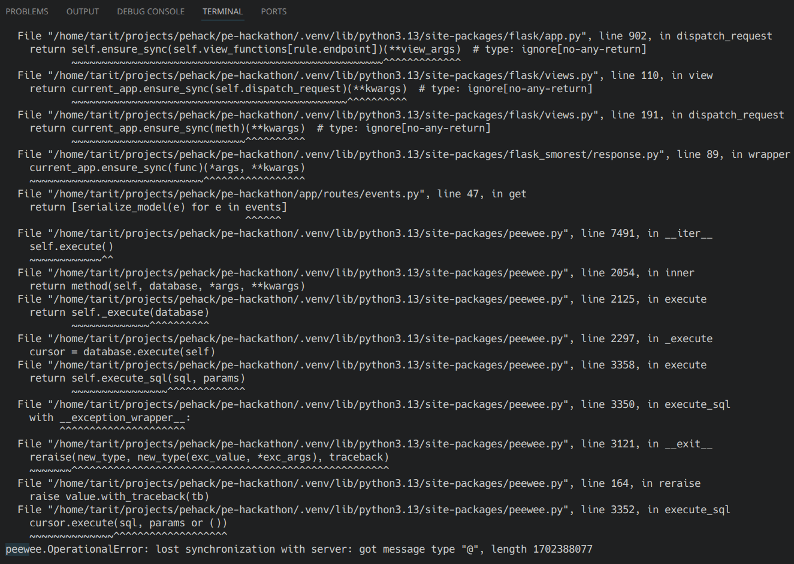

# Bottleneck Analysis: Database Connection Pooling

## Issue Discovered

During load testing with 500 concurrent users, we observed `psycopg2.OperationalError: lost synchronization with server` errors. All failures occurred during the initial ramp-up phase.



### Root Cause

Two problems were identified:

1. **Connection corruption under concurrency** — Multiple concurrent requests sharing the same database connection caused PostgreSQL protocol desynchronization. Bytes from different requests interleaved on the wire, producing garbage message types.

2. **Thundering herd on startup** — The connection pool created connections lazily. When many users hit simultaneously during ramp-up, all requests tried to open connections at once, overwhelming PostgreSQL.

### Fixes Applied

| Change | File | Details |
|---|---|---|
| Switched to `PooledPostgresqlDatabase` | `app/database.py` | Proper connection pooling with per-thread connection isolation |
| Added `timeout=10` | `app/database.py` | Requests wait for a free connection instead of corrupting a shared one |
| Changed `teardown_appcontext` to `teardown_request` | `app/database.py` | Connections are returned to the pool reliably at the end of each request |
| Pool pre-fill on startup | `app/database.py` | Pre-creates `DATABASE_MIN_CONNECTIONS` (default 10) connections so the first wave of traffic doesn't trigger a connection storm |
| Increased PostgreSQL `max_connections` | `compose.dev.yml`, `k8s/postgres-cluster.yaml` | Set to 200 to accommodate multiple workers |

## Current Configuration

### Kubernetes (Production)

| Parameter | Value | Source |
|---|---|---|
| PostgreSQL `max_connections` | 200 | `k8s/postgres-cluster.yaml` |
| App replicas | 3 | `k8s/app-deployment.yaml` |
| Gunicorn workers per pod | 2 | `Dockerfile` |
| Threads per worker | 4 | `Dockerfile` |
| Pool `max_connections` per worker | 20 (default) | `app/database.py` |
| Pool `min_connections` per worker | 10 (default) | `app/database.py` |

**Total potential connections: 3 replicas x 2 workers x 20 max = 120**

This fits within PostgreSQL's 200 limit with 80 connections of headroom (for superuser access, migrations, monitoring, etc.).

### Docker Compose (Development)

| Parameter | Value | Source |
|---|---|---|
| PostgreSQL `max_connections` | 200 | `compose.dev.yml` (via `command` flag) |
| Pool `max_connections` per worker | 20 (default) | `app/database.py` |

## Future Risk: Scaling Beyond Current Limits

### The constraint

PostgreSQL `max_connections` is a **global** limit shared across all workers in all pods. The per-worker pool size (`DATABASE_MAX_CONNECTIONS`) is **per process**.

```
total_connections = replicas x workers_per_pod x max_connections_per_worker
```

### When this becomes a problem

| Scenario | Replicas | Workers | Pool Max | Total | Fits in 200? |
|---|---|---|---|---|---|
| Current | 3 | 2 | 20 | 120 | Yes |
| Scale replicas to 5 | 5 | 2 | 20 | 200 | Barely (no headroom) |
| Scale replicas to 6+ | 6 | 2 | 20 | 240 | No |
| Increase workers to 4 | 3 | 4 | 20 | 240 | No |
| Scale both | 5 | 4 | 20 | 400 | No |

### Recommended actions before scaling

1. **Add `DATABASE_MAX_CONNECTIONS` to `k8s/configmap.yaml`** — Currently not set, relying on the code default of 20. Making it explicit and configurable per environment avoids surprises.

2. **Increase PostgreSQL `max_connections`** — If scaling beyond 5 replicas or increasing workers, bump this in `k8s/postgres-cluster.yaml`. Each additional 100 connections costs roughly 5-10 MB of PostgreSQL memory.

3. **Consider PgBouncer** — For large-scale deployments (10+ replicas), a connection pooler like PgBouncer in front of PostgreSQL is more efficient than each worker maintaining its own pool. PgBouncer multiplexes many application connections over fewer PostgreSQL connections.

4. **Monitor connection usage** — Add a Prometheus metric or Grafana dashboard tracking active vs. available pool connections per worker, and PostgreSQL's `numbackends` from `pg_stat_database`, to detect saturation before it causes errors.
